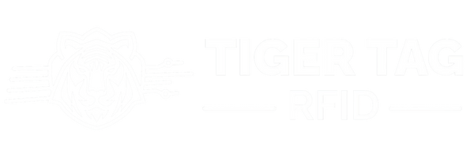

# TigerTag Python SDK


**Offline Python SDK for TigerTag RFID material identification.**

> TigerTag is an open-source RFID protocol for identifying manufacturing materials.
> Currently: filament, resin. Designed to extend to any physical material
> (sheet goods, wood, PMMA, metals, composites…).
> All material data is stored directly on the NTAG chip — 100% offline.

---

## Scope

| TigerTag type    | This SDK (Offline)       | Future Online SDK        |
|------------------|--------------------------|--------------------------|
| TigerTag (Maker) | ✅ full support           | ✅ full support           |
| TigerTag Init    | ✅ full support           | ✅ full support           |
| TigerTag+        | ✅ full support (offline) | ✅ chip + cloud (API)     |

TigerTag+ tags carry a cloud product ID alongside all standard material data.
This SDK reads all chip data identically — no functional difference in offline mode.

---

## Install

```bash
pip install tigertag                    # core only (stdlib, works offline)
pip install tigertag[sync]              # + requests  (database updates)
pip install tigertag[verify]            # + cryptography (ECDSA verification)
pip install tigertag[full]              # everything
```

---

## Quick start

```python
from tigertag import TigerTag

tag = TigerTag.from_pages(payload, uid=uid)   # from NFC SDK
print(tag.pretty())                            # human-readable summary
print(tag.verify())                            # ECDSA result
print(tag.to_dict())                           # dict for JSON / API
```

That's it. No configuration. No network. Works immediately after `pip install`.

---

## API reference

### Constructors

| Method | Input | Use when |
|--------|-------|----------|
| `TigerTag.from_pages(payload, uid)` | 80 or 144 bytes + 7-byte UID | NFC SDK integration (**recommended**) |
| `TigerTag.from_dump(data)` | 80 / 144 / 180 bytes | Binary dumps, ACR122U raw read |
| `TigerTag.from_file(path)` | path to `.bin` file | Testing, offline processing |

**`from_pages`** is the primary constructor for production use. Pass the raw bytes
from your NFC SDK — the UID separately (exactly as the SDK provides it) enables
full signature verification.

**`from_dump` with 180 bytes** automatically extracts the 7-byte UID from system pages.

### Key methods

```python
tag.pretty(db=None, sig_result=None) -> str      # human-readable
tag.to_dict(db=None)                 -> dict     # JSON-serializable
tag.to_bytes(include_signature=False)-> bytes    # re-serialize
tag.validate()                       -> list[str]# sanity check warnings
tag.verify(db=None)                  -> SignatureResult
tag.sync_db(db_path=None, force=False)-> list[str]  # update databases
```

### Key properties

```python
tag.is_maker          # True if id_product == 0xFFFFFFFF
tag.is_init           # True if id_product == 0x00000000
tag.is_signed         # True if signature pages are non-zero
tag.uid_hex           # "04AABBCCDDEE11" or None
tag.color1_hex        # "#FF3232"
tag.td_value          # 12.5  (HueForge Transmission Distance)
tag.manufacturing_date# datetime (UTC)
tag.stock_percent     # 75.0  or None
```

### SignatureResult

```python
result = tag.verify()
result.ok      # True only for VALID
result.status  # "valid" | "invalid" | "unsigned" | "no_crypto" | "no_key" | "no_uid"
str(result)    # "✅ VALID" | "❌ INVALID" | "⬜ NOT SIGNED" | …
result.to_dict()  # {"status": ..., "ok": ..., "detail": ...}
```

### Write operations (CRUD)

```python
# Build a new tag from scratch
tag = TigerTag.create(
    uid=bytes.fromhex("04A1B2C3D4E5F6"),
    id_material=38219,        # PLA
    id_brand=19961,           # Rosa3D
    nozzle_temp_min=195,
    nozzle_temp_max=230,
    color1_r=255, color1_g=0, color1_b=0, color1_a=255,
    measure=1000, id_unit=21,
)

# Create a blank TigerTag Init chip ready for programming
init_tag = TigerTag.as_init(uid=bytes.fromhex("04A1B2C3D4E5F6"))

# Erase a chip (returns 80 zero bytes — write these to the NFC chip)
blank = TigerTag.erase()

# Immutable surgical field update (returns a new TigerTag)
patched = tag.patch(nozzle_temp_min=200, dry_temp=55)

# Apply cloud API values and get a list of what changed
patched_tag, diffs = tag.patch_from_api()

# Compare chip fields vs TigerTag+ cloud API
diffs = tag.diff_api()

# Fetch raw TigerTag+ cloud product data (requires requests)
api_data = tag.raw_api()
```

| Method | Returns | Description |
|--------|---------|-------------|
| `TigerTag.create(**kwargs)` | `TigerTag` | Build a new tag from scratch with all fields |
| `TigerTag.as_init(uid)` | `TigerTag` | Create a blank TigerTag Init chip |
| `TigerTag.erase()` | `bytes` | 80 zero bytes — write to chip to wipe back to blank NDEF |
| `tag.patch(**kwargs)` | `TigerTag` | Immutable surgical update of any non-protected field |
| `tag.patch_from_api(api_data, db)` | `(TigerTag, list[ApiDiff])` | Apply cloud API values to chip fields |
| `tag.diff_api(api_data, db)` | `list[ApiDiff]` | Compare all chip fields vs TigerTag+ cloud API |
| `tag.raw_api(db)` | `dict \| None` | Fetch live TigerTag+ cloud product data |

**Protected fields** (cannot be patched, `patch()` raises `ValueError`): `id_tigertag`, `id_product`, `uid`, `signature_r`, `signature_s`.

### ApiDiff

`ApiDiff` is a namedtuple `(field, chip_value, api_value)` returned by `diff_api()` and `patch_from_api()`.

```python
from tigertag import ApiDiff, TigerTag

tag = TigerTag.from_pages(payload, uid=uid)
diffs = tag.diff_api()

for d in diffs:
    print(f"{d.field}: chip={d.chip_value!r} → api={d.api_value!r}")

# Apply all diffs automatically
patched_tag, applied = tag.patch_from_api()
print(f"{len(applied)} field(s) updated from cloud")
```

Fields compared by `diff_api()`: `nozzle_min`, `nozzle_max`, `bed_min`, `bed_max`, `dry_temp`, `dry_time`, `type`, `material`, `brand`, `diameter`, `aspect_1`, `aspect_2`, `color_1`, `color_2`, `color_3`, `measure_g`, `measure_unit`.

### TigerTagDB

```python
from tigertag import TigerTagDB

db = TigerTagDB()                          # uses bundled database (offline)
db = TigerTagDB(auto_sync=True)            # checks for updates on init
db = TigerTagDB("/path/to/db")             # custom database path

db.material(38219)    # {"id": 38219, "label": "PLA", "density": 1.24, ...}
db.brand(1)           # {"id": 1, "label": "Generic", ...}
db.version(0x01000001)# {"id": ..., "label": ..., "public_key": "-----BEGIN..."}
TigerTagDB.label(entry) -> str             # safe label extraction
```

---

## NFC SDK integration

`from_pages()` accepts exactly what NFC SDKs provide:

```python
# Android (NfcA / MifareUltralight)
uid     = tag.id                          # ByteArray → bytes
payload = mifare.readPages(4, 39)         # 144 bytes

# iOS (CoreNFC)
uid     = tag.identifier                  # Data → bytes
payload = tag.readNDEF(...)               # pages 4-39

# Flutter (flutter_nfc_kit)
uid     = bytes.fromhex(tag.id)
payload = await FlutterNfcKit.readBlock(4, length=144)

# Python nfcpy / ACR122U
uid     = tag.identifier                  # bytes
payload = tag.read(4, 36)                 # 36 pages × 4 bytes

tag = TigerTag.from_pages(payload, uid=uid)
result = tag.verify()  # fully autonomous
```

### ACR122U — exemple complet (nfcpy)

```bash
pip install nfcpy tigertag[verify]
```

```python
import nfc
from tigertag import TigerTag

def on_connect(tag):
    uid     = tag.identifier   # 7 bytes — fourni directement par nfcpy
    payload = tag.read(4, 36)  # 36 pages × 4 bytes = 144 bytes (pages 0x04–0x27)

    tt = TigerTag.from_pages(payload, uid=uid)

    print(tt.pretty())         # résumé lisible
    print(tt.verify())         # ✅ VALID / ⬜ NOT SIGNED / ❌ INVALID
    return True

with nfc.ContactlessFrontend("usb") as clf:
    print("En attente d'un tag TigerTag…")
    clf.connect(rdwr={"on-connect": on_connect})
```

> **Note :** nfcpy nécessite d'avoir accès au périphérique USB. Sur Linux, ajouter l'utilisateur au groupe `plugdev` ou lancer en root. Sur macOS/Windows, les drivers ACR122U doivent être installés.

See [`examples/integrate_nfc_sdk.py`](examples/integrate_nfc_sdk.py) for all platforms.

---

## Accepted input formats

### `from_pages(payload, uid)` — NFC SDK workflow (recommended)

NFC SDKs always expose the UID as a dedicated property and the page data
separately — pages 0–3 (system pages: lock bytes, capability container) are
never part of the NDEF payload. This is the normal integration path:

| Payload size | Pages | UID argument | Signature |
|---|---|---|---|
| 144 bytes | 0x04–0x27 (user data + ECDSA signature) | Required (7 bytes) | **Verifiable** |
| 80 bytes | 0x04–0x17 (user data only) | Required (7 bytes) | N/A (unsigned tag) |

```python
uid     = chip.uid                      # 7 bytes, from NFC SDK
payload = chip.read_pages(4, 39)        # 144 bytes, pages 0x04–0x27
tag = TigerTag.from_pages(payload, uid=uid)
print(tag.verify())                     # ✅ VALID
```

### `from_dump(data)` — binary dump workflow (debug / proxmark / ACR122U)

When reading a raw dump that includes the chip system pages (pages 0–3),
the UID can be auto-extracted. For partial dumps without system pages, the
UID is unavailable and the signature cannot be verified.

| Dump size | Content | UID | Signature |
|---|---|---|---|
| 180 bytes | Full chip dump (pages 0–44) | Auto-extracted from pages 0–1 | **Verifiable** |
| 144 bytes | Partial dump (pages 0x04–0x27, no system pages) | Not available | Not verifiable |
| 80 bytes | User data only (pages 0x04–0x17) | Not available | N/A |

---

## Auto-update behavior

The SDK ships with bundled reference databases — it works fully offline after
`pip install tigertag`. Updates are opt-in:

1. **Bundled** (default) — always usable, never empty, no network required
2. **`TigerTagDB(auto_sync=True)`** — checks timestamps on init, downloads only changed files
3. **`tag.sync_db(force=True)`** — forces full re-download
4. **Network failure** — caught silently, bundled databases are used as fallback
5. **`tigertag --sync-only`** — CLI sync, updates bundled database in place

Sources: TigerTag API → GitHub mirror (automatic fallback).

---

## Playground

An interactive browser UI for testing and exploring TigerTag data — no NFC hardware required.

```bash
python3 tools/server.py 7432
# then open: http://localhost:7432/tools/playground.html
```

The playground features a 3-column layout:

- **Left** — input form with TigerTag / TigerTag+ / Init modes and 6 demo presets
- **Center** — output cards: Protocol, Material, Colors & Finish, Print Settings, Quantity, Traceability, and a Cloud API card for TigerTag+ tags
- **Right** — collapsible SDK output panel with tabs: `pretty()`, `describe()`, `verify()`, `to_raw_dict()`, `to_dict()`, `raw_api()`, `diff_api()`

The playground calls `POST /api/diff` on the dev server, which runs the Python SDK server-side and returns diffs as JSON — identical to calling `tag.diff_api()` in code.

---

## CLI

```bash
tigertag dump.bin              # parse + human-readable output
tigertag dump.bin --json       # output as JSON
tigertag dump.bin --raw        # raw dataclass, no DB lookup
tigertag --sync-only           # update databases and exit
tigertag --version             # show SDK version
python -m tigertag dump.bin    # same, via module runner
```

---

## Standalone single-file usage

For projects where you can't add a dependency, copy `parse_tigertag.py`
directly into your project:

```python
from parse_tigertag import TigerTag

tag = TigerTag.from_dump(open("dump.bin", "rb").read())
tag.sync_db()        # auto-download databases (requires requests)
print(tag.pretty())
```

The standalone file is a copy of the full package logic and works independently
without the `tigertag/` package.

---

## Binary layout (NTAG chip pages 0x04–0x27)

```
Page    Offset  Size  Field
──────  ──────  ────  ──────────────────────
0x04    +0      4B    ID TigerTag   (u32 BE)
0x05    +4      4B    ID Product    (u32 BE)
0x06    +8      2B    ID Material   (u16 BE)
0x06    +10     1B    ID Aspect 1   (u8)
0x06    +11     1B    ID Aspect 2   (u8)
0x07    +12     1B    ID Type       (u8)
0x07    +13     1B    ID Diameter   (u8)
0x07    +14     2B    ID Brand      (u16 BE)
0x08    +16     4B    Color 1 RGBA  (bytes)
0x09    +20     3B    Measure       (u24 BE)
0x09    +23     1B    ID Unit       (u8)
0x0A    +24     2B    Nozzle Min    (u16 BE, °C)
0x0A    +26     2B    Nozzle Max    (u16 BE, °C)
0x0B    +28     1B    Dry Temp      (u8, °C)
0x0B    +29     1B    Dry Time      (u8, hours)
0x0B    +30     1B    Bed Min       (u8, °C)
0x0B    +31     1B    Bed Max       (u8, °C)
0x0C    +32     4B    Timestamp     (u32 BE, sec since 2000-01-01)
0x0D    +36     3B    Color 2 RGB   (bytes)
0x0E    +40     3B    Color 3 RGB   (bytes)
0x0F    +44     2B    HueForge TD   (u16 BE, value/10)
0x10    +48     28B   Custom msg    (UTF-8)
0x17    +76     3B    Avail. qty    (u24 BE)
0x18    +80     32B   Sig R         (ECDSA, optional)
0x20    +112    32B   Sig S         (ECDSA, optional)
```

---

## TigerTag ecosystem

Official tools built on the same protocol:

| Tool | Platform | Description |
|------|----------|-------------|
| [TigerTag Studio Manager](https://github.com/TigerTag-Project/TigerTag-Studio-Manager) | Windows / macOS / Linux | Desktop inventory manager, ACR122U integration |
| [Tiger Scale](https://github.com/TigerTag-Project/Tiger-Scale) | ESP32 DIY | Smart scale — reads tag, weighs spool, updates `measure_available` in real time |
| [TigerTag RFID Connect (iOS)](https://apps.apple.com/fr/app/tigertag-rfid-connect/id6745437963) | iOS | Official mobile app |
| [TigerTag RFID Connect (Android)](https://play.google.com/store/apps/details?id=com.tigertag.connect) | Android | Official mobile app |
| [TigerTag Firebase Integration](https://github.com/TigerTag-Project/TigerTag_Firebase_Integration) | Cloud | Firebase backend integration example |

Community integrations: [OpenRFID](https://github.com/suchmememanyskill/OpenRFID), [Home Assistant](https://github.com/Kenny3231/TigerTag), [Snapmaker U1 firmware](https://github.com/paxx12-snapmaker-u1/SnapmakerU1-Extended-Firmware).

---

## License

**Open source:** GNU General Public License v3.0 — see [LICENSE.md](LICENSE.md)

**Commercial OEM licensing:** contact licensing@tigertag.io

Protocol spec: [github.com/TigerTag-Project/TigerTag-RFID-Guide](https://github.com/TigerTag-Project/TigerTag-RFID-Guide)
